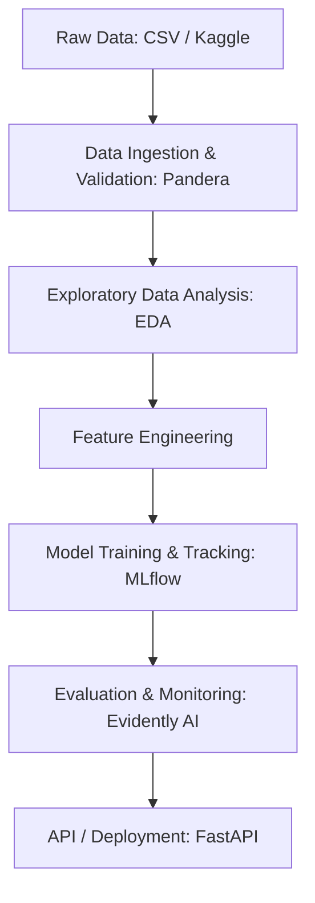

# Fraud Detection Pipeline

End-to-end machine learning system for detecting fraudulent transactions using a production-ready data pipeline, data quality contracts, and modular ML architecture.

---

## Architecture Overview

---

## Key Features

- Data Validation: Schema enforcement with Pandera to catch data issues early.
- Experiment Tracking: Full lineage of parameters, metrics (ROC-AUC, PR-AUC), and artifacts via MLflow.
- Model Registry: Centralized management of model versions in Staging and Production.
- Drift Monitoring: Automated generation of HTML reports for Data and Prediction Drift using Evidently.
- Deployment: Production-ready API for fraud scoring.

---

## Quick Start

### 1. Environment Setup

# Recommended Python 3.12
python -m venv .venv

# Windows:
.\.venv\Scripts\Activate.ps1

# Unix/MacOS:
source .venv/bin/activate

pip install -r requirements.txt

### 2. Run Pipeline

# Train and Register Model
python src/models/train_lgbm.py

# Run Monitoring (Generates HTML Report)
python src/monitoring/prediction_drift.py

# Start Prediction API
uvicorn src.app:app --reload

---

## API Usage

Endpoint: POST /predict

Example Payload:
{
  "amount": 8000.0,
  "hour": 14,
  "day_of_week": 3,
  "txn_count_1h": 5,
  "txn_sum_24h": 12500.5,
  "user_id": 102,
  "device_id": 5,
  "transaction_id": 999
}

---

## Results

- Best model ROC-AUC: 0.7607
- PR-AUC: 0.0478
- Model Registry: Model currently hosted in MLflow Registry under fraud_lightgbm.

---

Author: Jose David Gomez